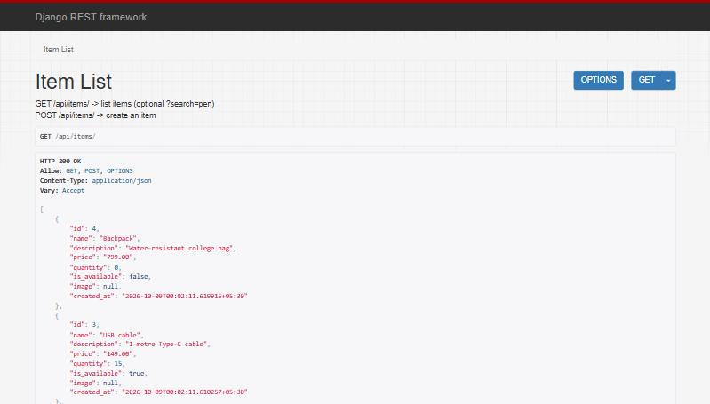
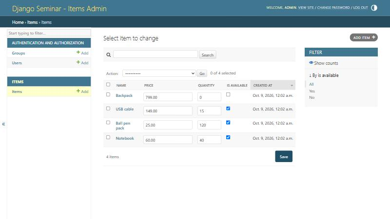

# Django Seminar: Django + Django REST Framework for beginners

A small, well-commented **Django project** (a simple *Item* API) and a **presentation** that teach the basics of Django. It is written for MCA students who already know the basics of the MERN stack and are new to Django.

> **Seminar slides:** [`slides/Django-Seminar.pptx`](slides/Django-Seminar.pptx) (27 slides)
> **New to GitHub?** Read [`docs/github-basics.md`](docs/github-basics.md) first.

| Browsable API (`/api/items/`) | Admin panel (`/admin/`) |
| --- | --- |
|  |  |

---

## Table of contents

1. [What you will learn](#1-what-you-will-learn)
2. [What you need before starting](#2-what-you-need-before-starting)
3. [Get the code](#3-get-the-code)
4. [Setup: step by step](#4-setup-step-by-step)
5. [Use the project](#5-use-the-project)
6. [Project structure](#6-project-structure)
7. [Django concepts in 5 minutes](#7-django-concepts-in-5-minutes)
8. [Django vs MERN](#8-django-vs-mern)
9. [Command cheat sheet](#9-command-cheat-sheet)
10. [Troubleshooting](#10-troubleshooting)
11. [Going further](#11-going-further)

---

## 1. What you will learn

- Why Django, and how **MVT** (Model, View, Template) compares with **MERN**
- Creating a **virtual environment**, installing Django and starting a project
- **Project vs app**, and the important parts of `settings.py`
- **Models**: how Python classes map to database tables, field types and attributes
- The **ORM** (what it is and why it matters)
- **Migrations**: `makemigrations` vs `migrate`
- **Views** and **URLs** (`views.py`, `urls.py`)
- **Django REST Framework**: serializers and API views returning JSON
- The **admin panel**: superuser, `ModelAdmin`, `list_display`, `list_filter`, `search_fields`, `ordering`
- Built-in **security**: SQL injection, CSRF, XSS
- Connecting an **external database** (MySQL / PostgreSQL), and real-world use of Django

The demo project is intentionally small: **one model (`Item`), two API views, one serializer and an admin page**. There are no HTML templates or forms; the API returns JSON.

## 2. What you need before starting

| Tool | Version | Check with |
| --- | --- | --- |
| Python | 3.10 or newer (3.12 tested) | `python --version` |
| pip | comes with Python | `pip --version` |
| Git (optional) | any | `git --version` |

Get Python from <https://www.python.org/downloads/>. On Windows, tick **"Add python.exe to PATH"** in the installer.
Git is optional: you can also download the code as a ZIP file.

## 3. Get the code

**Option A: with Git**

```bash
git clone https://github.com/<your-username>/mca.git
cd mca/django-seminar
```

**Option B: without Git**

1. Open the repository page on GitHub.
2. Click the green **Code** button, then **Download ZIP**.
3. Extract the ZIP and open the `django-seminar` folder in your terminal (or in VS Code: *File > Open Folder*).

All following commands are run **inside the `django-seminar` folder** (the one that contains `manage.py`).

## 4. Setup: step by step

### Step 1. Create a virtual environment

A virtual environment gives this project its own set of Python packages (like `node_modules` in Node.js).

```bash
python -m venv venv
```

### Step 2. Activate it

Windows (PowerShell):

```bash
venv\Scripts\Activate.ps1
```

Windows (Command Prompt):

```bash
venv\Scripts\activate.bat
```

Mac / Linux:

```bash
source venv/bin/activate
```

You should now see `(venv)` at the start of your prompt.

### Step 3. Install the requirements

```bash
pip install -r requirements.txt
```

This installs Django, Django REST Framework and Pillow (needed for the optional image field).

### Step 4. Create the database tables

```bash
python manage.py migrate
```

This creates a file called `db.sqlite3` (the default database) with all the tables.

### Step 5. (Optional) Add sample data

```bash
python manage.py seed_demo
```

### Step 6. Create an admin user

```bash
python manage.py createsuperuser
```

Enter a username, an email (can be skipped) and a password. The password is not shown while you type: that is normal.

### Step 7. Start the server

```bash
python manage.py runserver
```

Leave this terminal open. Stop the server any time with `Ctrl + C`.

## 5. Use the project

Open these addresses in your browser while the server is running:

| Address | What it is |
| --- | --- |
| <http://127.0.0.1:8000/api/items/> | The API, with a form to create items |
| <http://127.0.0.1:8000/api/items/1/> | One item (view, update, delete) |
| <http://127.0.0.1:8000/api/items/?search=pen> | Search items by name |
| <http://127.0.0.1:8000/admin/> | Admin panel (log in with your superuser) |

### API endpoints

| Method | URL | Action |
| --- | --- | --- |
| `GET` | `/api/items/` | List all items (optional `?search=text`) |
| `POST` | `/api/items/` | Create an item |
| `GET` | `/api/items/<id>/` | Get one item |
| `PUT` | `/api/items/<id>/` | Update an item |
| `DELETE` | `/api/items/<id>/` | Delete an item |

Try creating an item from the command line (open a **second** terminal):

```bash
curl -X POST http://127.0.0.1:8000/api/items/ -H "Content-Type: application/json" -d "{\"name\": \"Pen\", \"price\": \"10.50\", \"quantity\": 25}"
```

An item looks like this:

```json
{
  "id": 1,
  "name": "Notebook",
  "description": "A4 ruled notebook, 200 pages",
  "price": "60.00",
  "quantity": 40,
  "is_available": true,
  "image": null,
  "created_at": "2026-10-09T00:02:11+05:30"
}
```

### Run the tests

```bash
python manage.py test
```

The tests cover the CRUD API, search, and two security checks (SQL injection text is treated as plain text; forms without a CSRF token are rejected).

## 6. Project structure

```text
django-seminar/
├── manage.py            # command-line tool: runserver, migrate, ...
├── requirements.txt     # Python packages (like package.json)
├── config/              # the PROJECT (settings and root URLs)
│   ├── settings.py      # all configuration, with comments
│   ├── urls.py          # root URL routes
│   ├── wsgi.py / asgi.py
├── items/               # the APP (one feature of the site)
│   ├── models.py        # Item model       -> database table
│   ├── serializers.py   # model <-> JSON
│   ├── views.py         # API views (the logic)
│   ├── urls.py          # URL routes of this app
│   ├── admin.py         # admin panel customisation (ModelAdmin)
│   ├── tests.py         # automated tests
│   ├── migrations/      # database change history
│   └── management/commands/seed_demo.py   # sample data command
├── docs/                # extra guides and screenshots
├── slides/              # the presentation (PowerPoint)
└── media/               # uploaded files (bonus feature)
```

**Where to start reading the code:** `items/models.py` -> `items/serializers.py` -> `items/views.py` -> `items/urls.py` -> `config/urls.py` -> `items/admin.py` -> `config/settings.py`. Every file has comments written for beginners.

## 7. Django concepts in 5 minutes

**MVT: Model, View, Template**

```text
Browser --request--> urls.py --> View (views.py) <--> Model (models.py) <--> Database
                                    |
                                    +--> Template / JSON (response) --> Browser
```

- **Model**: Python class that describes your data. One class is one table.
- **View**: Python function that receives a request and returns a response.
- **Template**: the HTML page returned to the user. In this API project, the *serializer* returns **JSON** instead.

**Project vs app.** A *project* is the whole website (`config/`). An *app* is one feature (`items/`). A project has many apps. After creating an app, add it to `INSTALLED_APPS` in `settings.py`.

**ORM** (Object-Relational Mapper). You write Python, Django writes the SQL:

```python
Item.objects.filter(is_available=True).order_by("-price")
# SELECT ... FROM items_item WHERE is_available = 1 ORDER BY price DESC
```

Try it: `python manage.py shell`

**Migrations.**

| Command | What it does |
| --- | --- |
| `python manage.py makemigrations` | Looks at your models and **writes** a migration file (a plan). The database is not touched. |
| `python manage.py migrate` | **Runs** the migration files on the database (creates or alters tables). |

Change a model, then run both commands. After `git pull`, run `migrate`.

**Admin panel.** Django builds a full back-office from your models. Register a model in `admin.py` and customise it with a `ModelAdmin` class (`list_display`, `list_filter`, `search_fields`, `ordering`, ...).

**Security built in.**

| Attack | Django's protection |
| --- | --- |
| SQL injection | The ORM sends values as query *parameters*, never glued into SQL |
| CSRF | `CsrfViewMiddleware` rejects form POSTs without a secret token (HTTP 403) |
| XSS | Templates and the admin escape HTML automatically |
| Clickjacking | `XFrameOptionsMiddleware` (`X-Frame-Options: DENY`) |
| Weak passwords | Passwords are hashed and validated |

## 8. Django vs MERN

| In MERN you write... | In Django you write... |
| --- | --- |
| Express route `app.get('/items')` | `urls.py`: `path("items/", views.item_list)` |
| Express handler / controller | A view function in `views.py` |
| Mongoose schema and model | A model class in `models.py` |
| React component / EJS template | A template, or a DRF serializer for JSON |
| MongoDB collection and document | Database table and row |
| `npm install` + `package.json` | `pip install` + `requirements.txt` |
| `node_modules` | `venv` (virtual environment) |
| `npm start` / `nodemon` | `python manage.py runserver` |

They work well together: a **React** frontend can call this **Django REST API**.

## 9. Command cheat sheet

| Command | Purpose |
| --- | --- |
| `python -m venv venv` | Create a virtual environment |
| `pip install -r requirements.txt` | Install the packages |
| `python manage.py runserver` | Start the development server |
| `python manage.py makemigrations` | Create migration files |
| `python manage.py migrate` | Apply migrations to the database |
| `python manage.py createsuperuser` | Create an admin account |
| `python manage.py shell` | Python shell with Django loaded (try the ORM) |
| `python manage.py seed_demo` | Add sample items |
| `python manage.py test` | Run the tests |
| `python manage.py showmigrations` | List migrations and whether they are applied |
| `python manage.py sqlmigrate items 0001` | Show the SQL of a migration |
| `python manage.py startapp <name>` | Create a new app |
| `python manage.py check` | Check the project for problems |

For starting a brand-new project from scratch:

```bash
django-admin startproject config .
python manage.py startapp items
```

## 10. Troubleshooting

| Problem | Fix |
| --- | --- |
| `python` is not recognised | Reinstall Python and tick *Add to PATH*, or try `py` (Windows) / `python3` (Mac, Linux) |
| PowerShell says *running scripts is disabled* when activating | Run `Set-ExecutionPolicy -Scope Process -ExecutionPolicy Bypass`, then activate again. Or use Command Prompt: `venv\Scripts\activate.bat` |
| `No module named django` | The virtual environment is not active (no `(venv)` in the prompt). Activate it and run `pip install -r requirements.txt` |
| `no such table: items_item` | Run `python manage.py migrate` |
| `Port is already in use` | Run on another port: `python manage.py runserver 8001` |
| Admin login does not work | Create a user with `python manage.py createsuperuser` |
| Want a fresh database | Stop the server, delete `db.sqlite3`, run `migrate` again |
| `You have unapplied migrations` warning | Run `python manage.py migrate` |

## 11. Going further

**Use MySQL or PostgreSQL instead of SQLite.** Only the `DATABASES` setting changes; models, views and admin stay the same. Ready-made examples are in the comments of [`config/settings.py`](config/settings.py).

```bash
pip install psycopg2-binary   # PostgreSQL
pip install mysqlclient       # MySQL
python manage.py migrate
```

**File and image handling (bonus, not part of the seminar).** The `Item` model already has an optional `image` field. See [`docs/image-handling.md`](docs/image-handling.md).

**More guides**

- [`docs/github-basics.md`](docs/github-basics.md): clone, download, pull, push, explained simply
- [`docs/demo-script.md`](docs/demo-script.md): step-by-step script for the live demo
- Official docs: <https://docs.djangoproject.com/> and <https://www.django-rest-framework.org/>

---

Made for an MCA college seminar. The `SECRET_KEY` in `settings.py` is a demo key: never use it, or `DEBUG = True`, in a real deployment.
